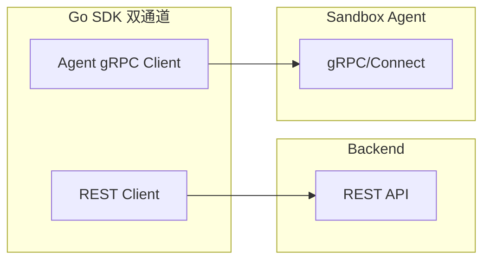

# Go SDK 后续实现分析计划

## 一、当前实现 vs Python 文件系统能力对照

| 功能                     | Python SDK                | Go SDK                                  | 状态            |
| ---------------------- | ------------------------- | --------------------------------------- | ------------- |
| list()                 | 支持 path, depth, user      | ListFiles(path, depth)                  | 已实现，缺 user    |
| read()                 | format: text/bytes/stream | Read()→[]byte, Download()→io.ReadCloser | 已实现，缺 text 便捷 |
| write()                | 单文件 + 批量 List[WriteEntry] | Write(), WriteFromReader()              | 缺批量写入         |
| exists()               | 支持                        | Exists()                                | 已实现           |
| get_info()             | 支持                        | GetInfo/Stat()                          | 已实现           |
| make_dir/rename/remove | 支持                        | -                                       | 不实现（后端未支持）    |
| watch_dir()            | 支持（可选）                    | -                                       | 待评估           |
| user 参数                | 所有方法支持 user               | 无                                       | 待确认后端支持       |
| 异步接口                   | async 版本                  | UploadAsync/DownloadAsync               | 已有 channel 方式 |

## 二、架构差异说明

Go SDK 采用 **REST + gRPC/Connect 双通道**：沙箱 CRUD、文件操作走 Backend REST；Commands、Code Interpreter、PTY、watch_dir 直连 Sandbox Agent。

## 三、文件系统待实现/增强项

### 1. 批量写入 WriteBatch（优先级：高）

**Python 能力**：`write(files: List[WriteEntry]) -> List[WriteInfo]`

**待办**：

- 在 [models/filesystem.go](models/filesystem.go) 已有 `WriteEntry`（Path, Data io.Reader, ContentLength）
- 在 [api/sandboxes/client.go](api/sandboxes/client.go) 新增 `WriteBatch(ctx, sandboxID, entries []WriteEntry) ([]WriteInfo, error)`
- **前提**：需确认后端 REST 是否支持批量上传。若仅支持单文件，则实现为循环调用 Write/Upload，返回聚合结果

### 2. read 格式便捷方法（优先级：低）

**Python**：`read(..., format="text"|"bytes"|"stream")`  
**Go 现状**：Read()→[]byte；Download()→流  
**可选**：增加 `ReadAsText(ctx, sandboxID, path) (string, error)`，内部调用 Read 后 `string(data)`。非必需，用户可自行转换。

### 3. user 参数（优先级：中）

**Python**：所有文件方法支持 `user: Username = "user"|"root"`  
**待办**：检查后端 list/stat/download/upload 的 REST 请求是否接受 `user` 查询参数或 header；若支持，在 [models/requests.go](models/requests.go) 和 [api/sandboxes/client.go](api/sandboxes/client.go) 中为 ListFiles、Stat、Read、Write、Download、Upload 等增加可选 `user string` 参数。

### 4. watch_dir（优先级：低，gRPC 阶段实现）

**Python**：通过 gRPC 流式 `WatchDir` 实现  
**实现方式**：随 gRPC/Connect 集成一并实现，使用 Sandbox Agent 的 `Filesystem.WatchDir` 或 `CreateWatcher` / `GetWatcherEvents`。

## 四、Python 其他模块（非文件系统）纳入 Go SDK 方案

根据 [SDK_FEATURES.md](scalebox-sdk-python/SDK_FEATURES.md)，Python SDK 还包含 Commands、Code Interpreter、PTY 等模块。后端 REST 未暴露对应端点，因此采用 **方案 2**：Go SDK 引入 **gRPC/Connect 客户端直连 Sandbox Agent**（与 Python SDK 一致）。

### 4.1 架构变更

| 模块               | 功能                                             | 实现方式                          |
| ---------------- | ---------------------------------------------- | ----------------------------- |
| Code Interpreter | run_code, create_code_context, destroy_context | gRPC/Connect 直连 Sandbox Agent |
| Commands         | run, list, kill, send_stdin, connect           | 同上                            |
| PTY              | create, send_stdin, resize, kill               | 同上                            |

### 4.2 双通道架构

Go SDK 将采用 **REST + gRPC/Connect 双通道**：

- **REST**：沙箱 CRUD、文件 list/stat/download/upload、端口管理（调用 Backend）
- **gRPC/Connect**：Commands、Code Interpreter、PTY、watch_dir（直连 Sandbox Agent）

详见 [go_sdk_gRPC_Connect_实施计划.md](go_sdk_gRPC_Connect_实施计划.md)。

## 五、推荐实施顺序

### 阶段一：REST 增强（已完成 / 进行中）

1. **验证后端 API**：确认 list/stat/upload 等是否支持 `user`、是否支持批量上传
2. **WriteBatch**：实现批量写入（基于后端能力选择真实批量或循环单次）
3. **user 参数**：为文件相关方法补充可选 user 参数
4. **端口管理**：实现 GetPorts、AddPort、RemovePort

### 阶段二：gRPC/Connect 直连（新计划）

1. **gRPC/Connect 集成**：引入 protobuf、Connect 客户端，实现 Commands、Code Interpreter、PTY、watch_dir

详见 [go_sdk_gRPC_Connect_实施计划.md](go_sdk_gRPC_Connect_实施计划.md)。

## 六、关键文件

- [api/sandboxes/client.go](api/sandboxes/client.go) - 沙箱 REST API 实现
- [models/filesystem.go](models/filesystem.go) - WriteEntry、EntryInfo 等模型
- [go_sdk_文件系统实现_f5e5b00k.plan.md](go_sdk_文件系统实现_f5e5b00k.plan.md) - 文件系统实现进度
- [go_sdk_gRPC_Connect_实施计划.md](go_sdk_gRPC_Connect_实施计划.md) - gRPC/Connect 实施计划

